
<h1 align="center">的宠物医院信息管理系统</h1>

## 简介
宠物医院信息管理系统：角色分为用户和医生；具备注册登录、预约管理、医生信息管理、药品信息管理、留言反馈、订单信息管理等功能。    --计算机毕业设计源码；毕设源码；java毕业设计源码

## 联系方式

<h3 align="center">获取完整代码与数据库文件 + 微信：deepguan QQ: 86050149 QQ群: 783742310</h3>

<h3 align="center">可帮忙远程部署 包运行成功！提供远程部署、修改代码、设计文档指导、代码讲解等服务！</h3>

## 功能介绍（完整见运行截图）
管理员：基本功能包括登录、注册和退出。网站支持管理主页导航栏，通过导航栏可实现医学知识、医生信息、药品、新闻资讯等重要模块的管理。管理员可以管理用户、医生、科室信息、订单以及消息反馈。系统提供药品信息的录入与编辑功能，例如上传药品图片、填写规格与生产商等。此外，还可管理预约挂号和医嘱信息，操作包括查看、修改、审核及删除。管理员也能通过数据表格进行信息浏览，并使用分页控件查看更多数据或进行批量操作。

用户：用户可登录和注册账户，在个人中心查看和修改个人信息。系统支持填写或修改宠物信息、预约日期与医生联系信息等。用户可使用导航栏浏览首页内容、医学知识文章、医生与药品信息，并通过搜索功能查找特定医生或药品。可提供反馈或留言，并与医生沟通交流。用户能够通过系统中的预约挂号模块进行挂号，查看或取消预约，提交留言反馈，并退出登录。

医生：医生通过登录进入系统，可查看有关自身的信息及管理患者预约。系统提供医生信息的管理功能，包括查看、添加、修改自身信息，与用户保持互动沟通。医生可查看患者的挂号信息、宠物状况及医嘱，并进行相应的处理或建议。此外，医生可参与对留言和反馈的管理工作，并处理预约信息或更新医生简介与专业领域信息。

游客：作为未注册用户，可以在网页浏览医学知识和新闻资讯，以认知了解宠物医院提供的服务。游客可访问首页的导航栏来查看更多关于医院、医生的资讯。若对医院信息有所需求，游客可注册成为用户或医生，通过系统提供的注册功能加入平台。游客用户通过了解系统支持模块及界面设计，留下期望实现的功能建议或意见反馈。

## 运行截图

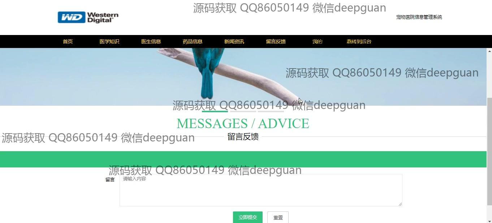
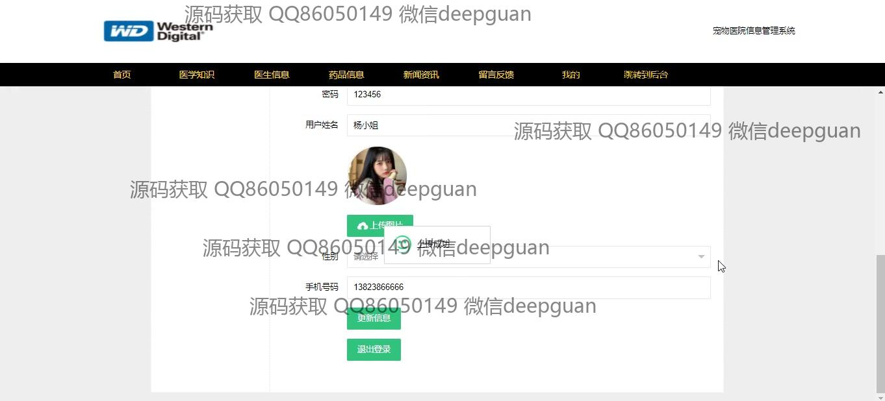

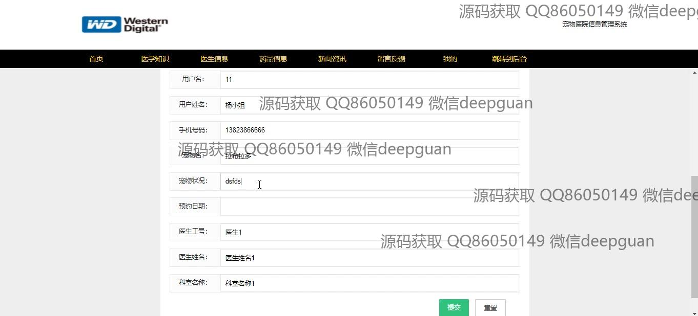
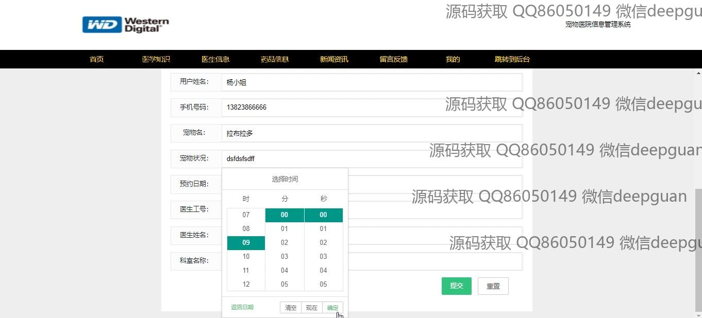
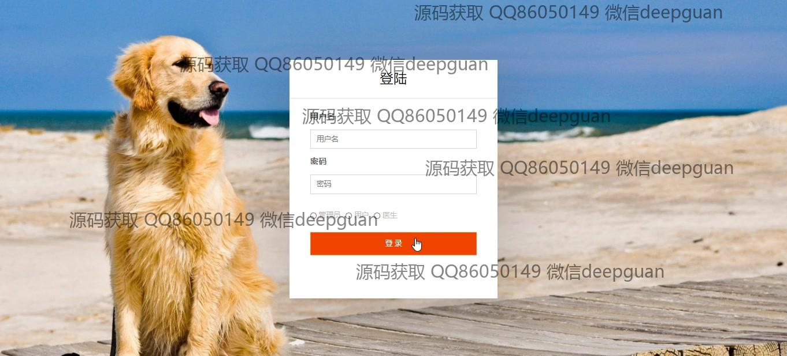
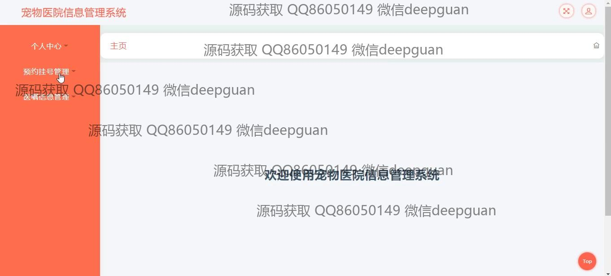
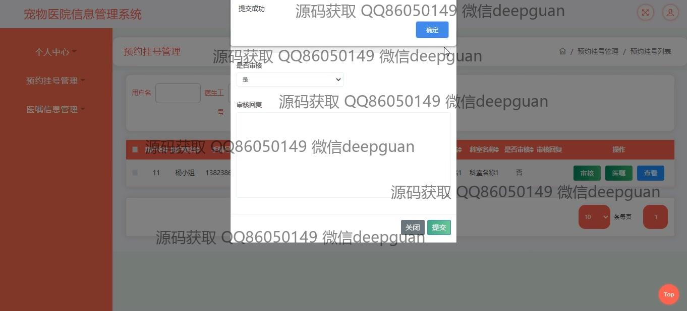
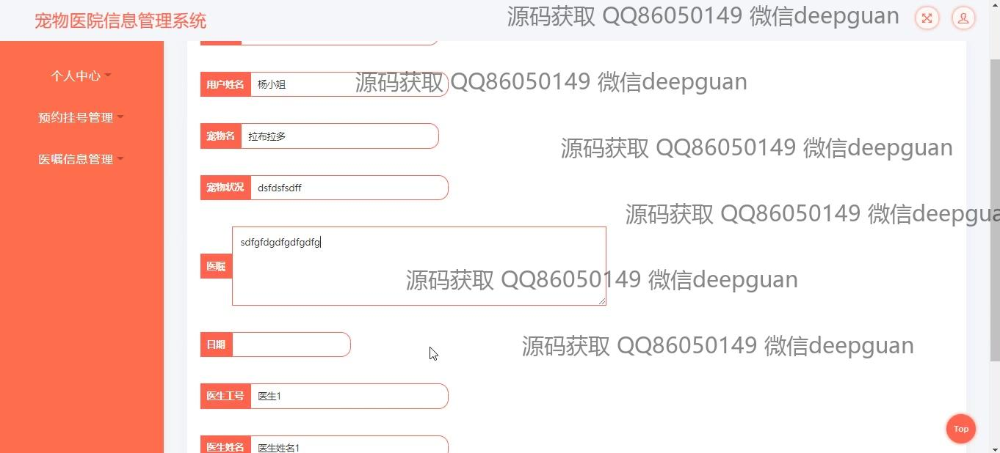
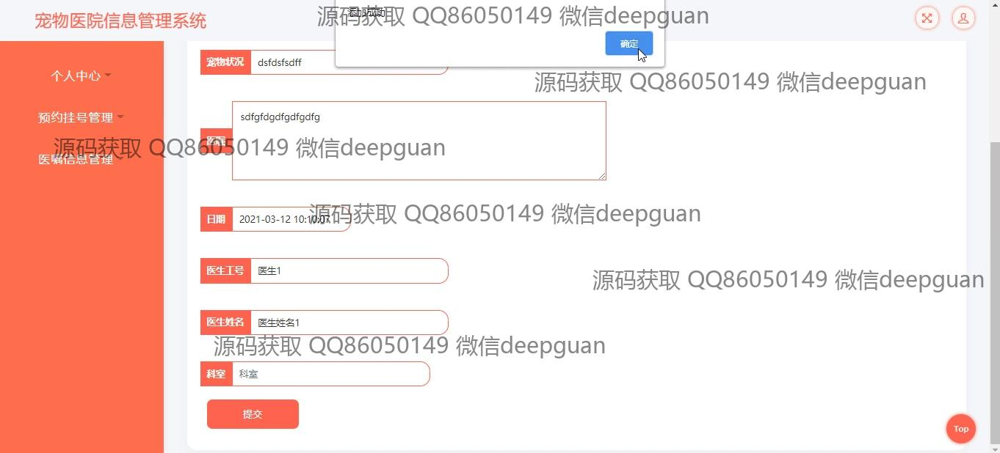

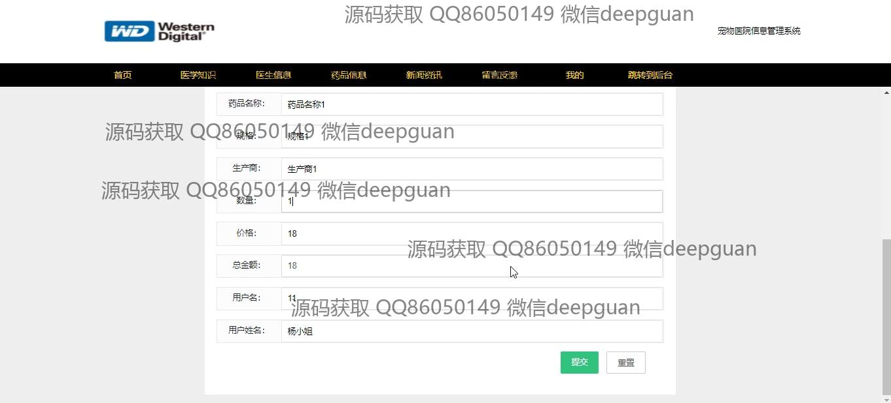
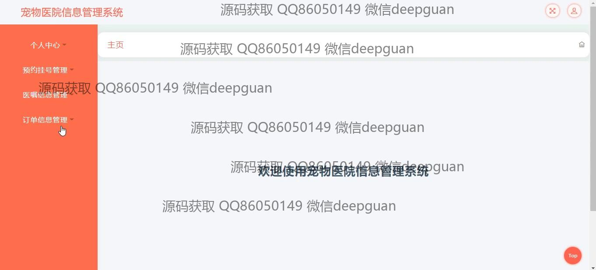
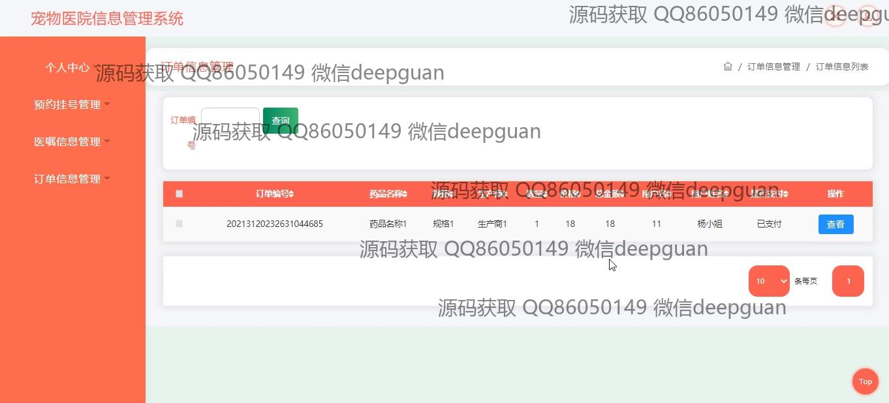
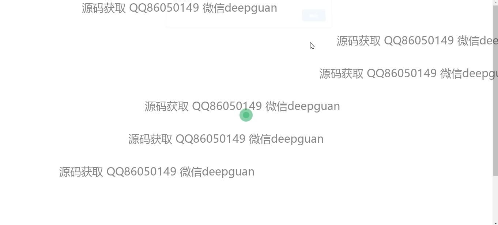

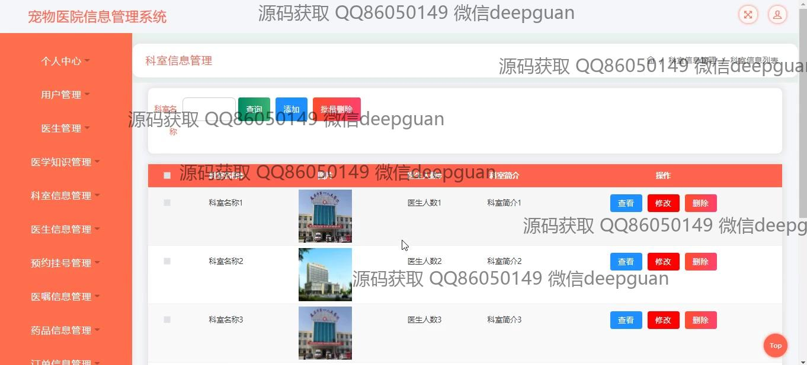
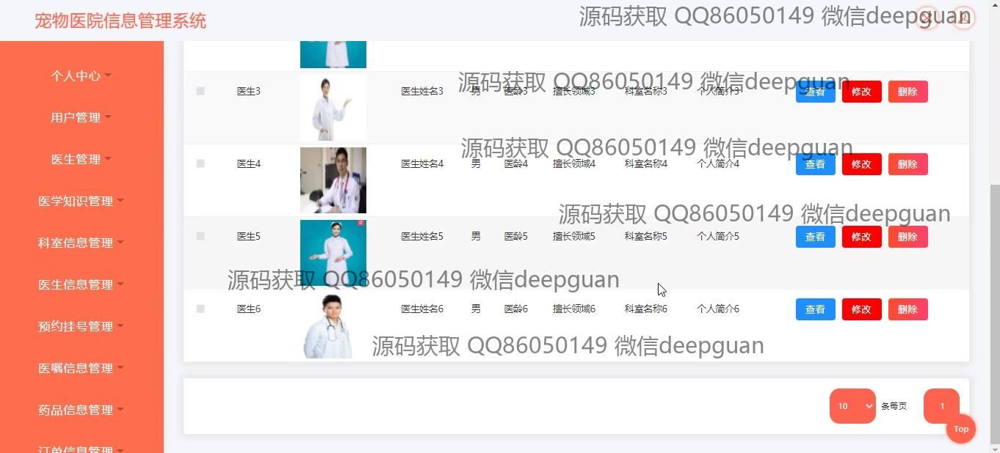
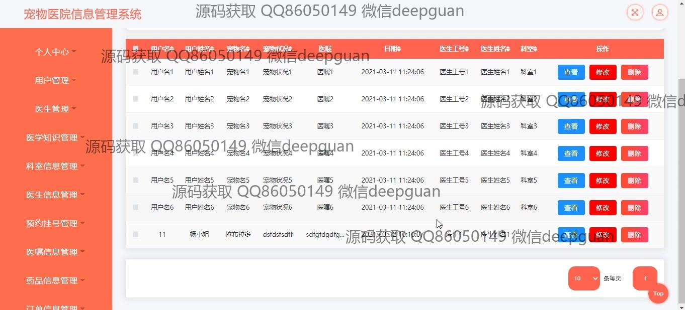
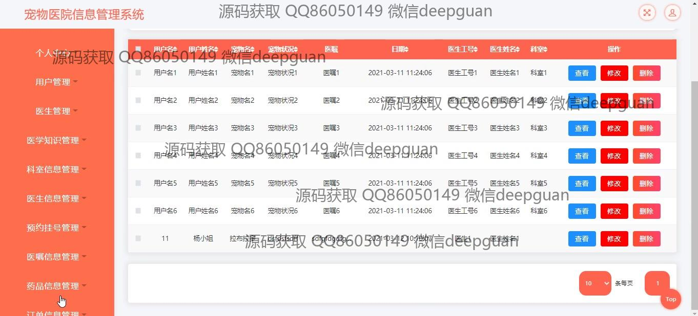
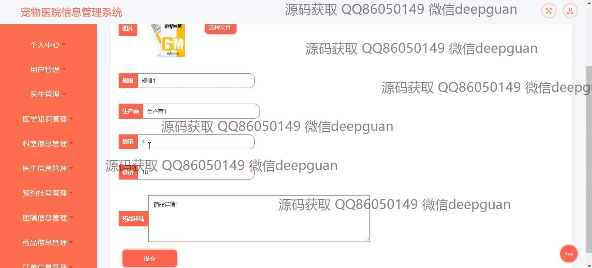
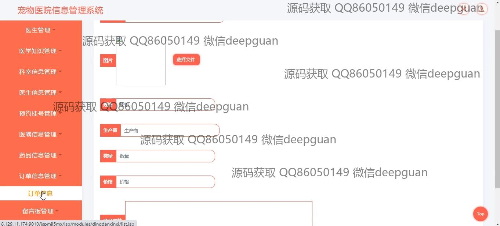

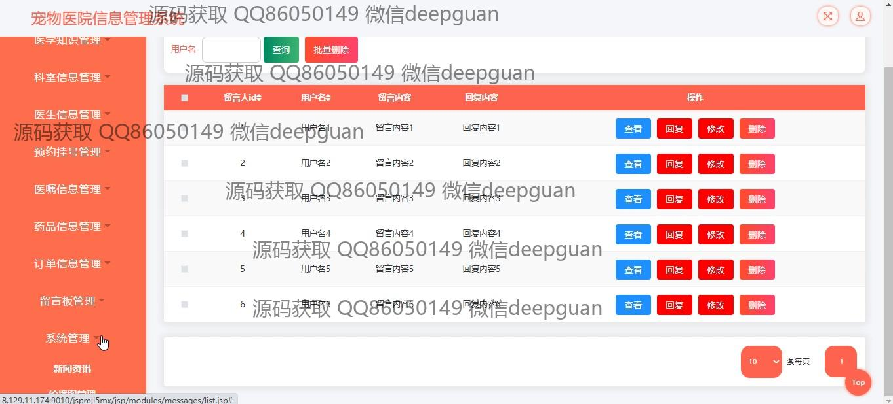
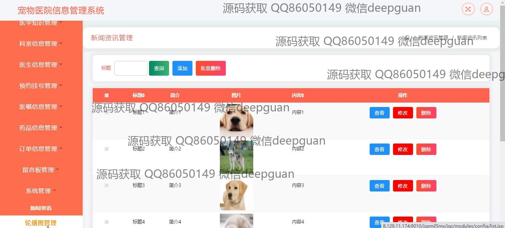

本代码来源于网络,仅供学习参考使用!

